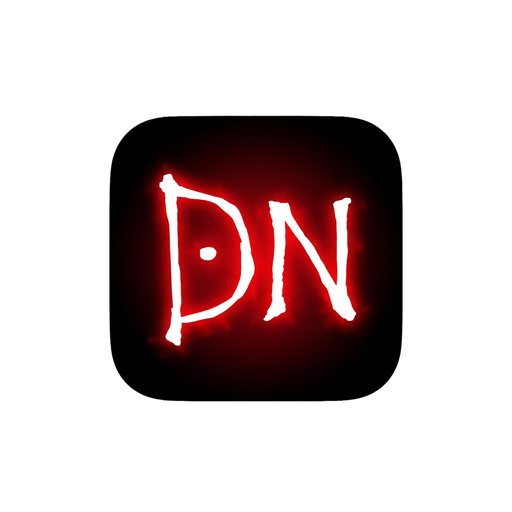
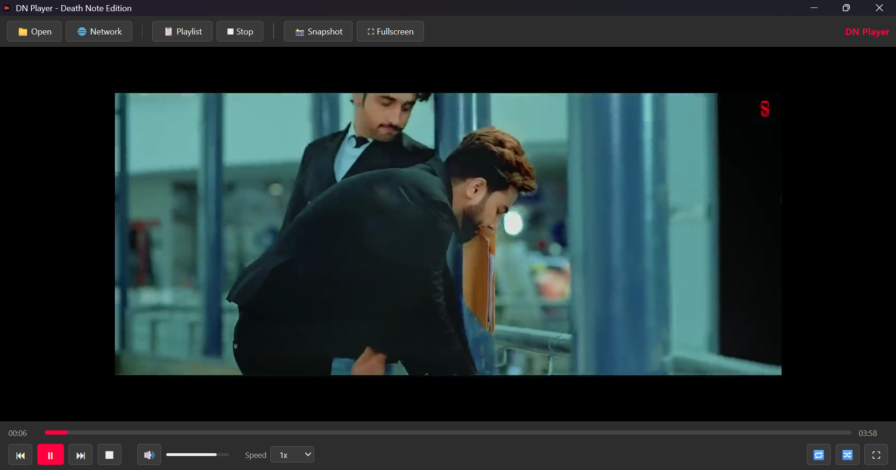
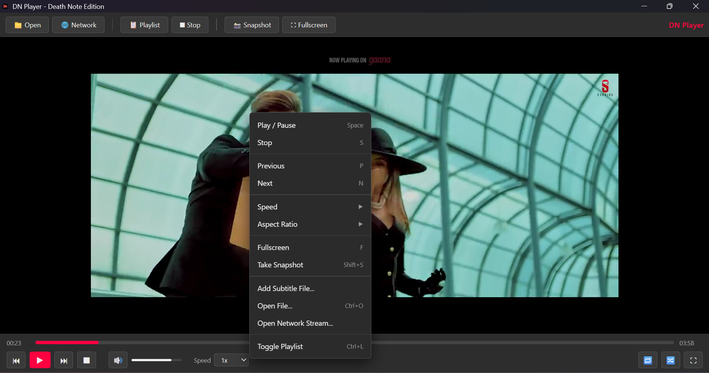
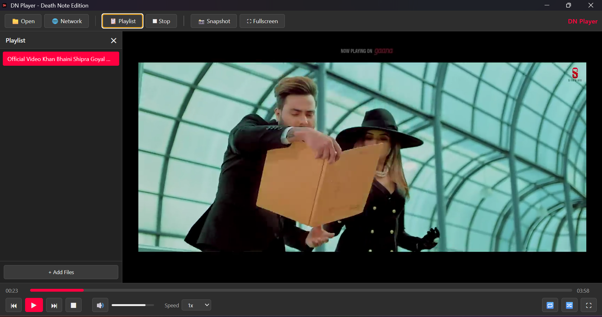

# DN Player by Jhony Walker Studio

🚀 Free, Lightweight Media Player for Windows 10/11 — Like VLC but faster and cleaner.



### ✨ Features
- ✅ No extra grey menu bar - Clean UI
- ✅ Right-click context menu like VLC (Speed, Aspect Ratio, Snapshot, etc.)
- ✅ Single toolbar - Easy to use
- ✅ Playlist support
- ✅ Snapshot, Fullscreen, Speed control
- ✅ Drag & Drop files
- ✅ Portable + Installer

### 📥 Download
Go to **Releases** section and download:
- `DN-Player-Setup-1.0.0.exe` - Installer (Desktop icon)
- `DN-Player-Portable-1.0.0.exe` - No install needed

Or build yourself:
```bash
npm install
npm run build-all
```

### 💖 Donate
If you like my work:
- **JazzCash / SadaPay:** `03710721332`
- **Easypaisa:** `03710721332`

Made with ❤️ in Sharqpur, Pakistan
by **Jhony Walker Studio**

### 📸 Screenshots
### 📸 Screenshots




### 📸 Demo


### 🛠️ Tech Stack
- Electron
- HTML5 Video
- Node.js
